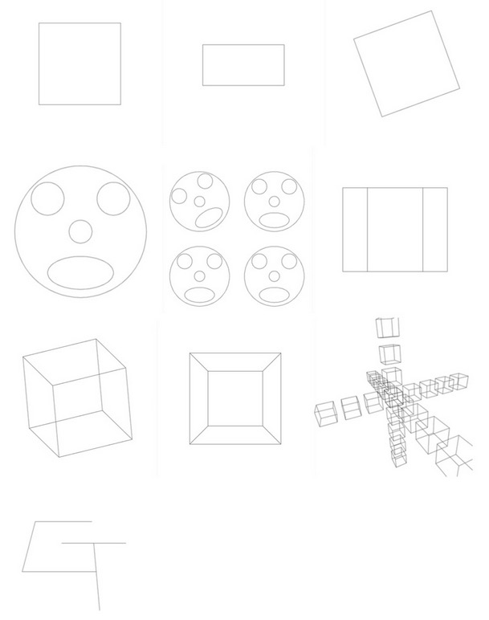

[](https://classroom.github.com/online_ide?assignment_repo_id=5655701&assignment_repo_type=AssignmentRepo)
# Assignment 1b:  Projection and Line Drawing

The goal of this project is to learn the underlying techniques used in a graphics library that is similar in design to early versions of OpenGL. In particular, you will implement transformation, projection, and mapping to the screen of user-provided lines. 

- You have implemented the transformation matrix creation in 1a, here you will use them along with projection and drawing commands.
- You will test out your code with the help of the provided routines for drawing a few simple images. 
- You will also create a routine that draws your initials on the screen in perspective.

## Due: Saturday September 18th, 11:59pm

## Rubric

Graded out of 10.

1. (4 points) 2 point each for implementing `ortho()` and `perspective()` correctly, 1 point each for the projection component, 1 point each for viewport mapping to the full screen correctly.
2. (1 point) Points created by `vertex()` are correctly transformed by the transformation and projection matrices.
3. (1 point) implement `vertex()` by matrix multiplication correctly.
4. (1 point) calling the `Drawing` `line()` method with the correct transformed values.
5. (1 point) implementing `beginShape()` and `endShape()` correctly.
4. (2 point) routine to draw your initials on the screen (1 point for drawing the initials, 1 point for satisfying the perspective requirements below).

## Project Description

As stated in the project objective, you will be implementing a collection of basic graphics library commands that are similar in style to early versions of the popular OpenGL library. 

The graphics library commands are implemented as methods on the `myDrawing` class in `app.ts`, a subclass of the `Drawing` class defined in `common.ts`. (We've moved most of the boilerplate code into a subclass for clarity;  you do not have to modify `common.ts`).

Part of these methods are the ones that you wrote for Project 1A. The following routines should act as they did in that earlier project:

- `init()`, now called `initMatrix()`
- `translate(x, y, z)`
- `scale(sx, xy, sz)`
- `rotateX(angle)`, `rotateY(angle)`, `rotateZ(angle)`
- `print()`, now called `printMatrix()`

You will also implement several new routines which allow a user to manipulate and display 3D lines. 

The provided source code contains empty methods for each of the following routines:

### `ortho(left, right, bottom, top, near, far)`

Specifies that an orthographic projection will be performed on subsequent vertices. The direction of projection is assumed to be along the z-axis. The six values passed to this routine describe a box to which all lines will be clipped. The `left` and `right` values specify the minimum and maximum x values that will be mapped to the left and right edges of the framebuffer. The `bottom` and `top` values specify the y values that map to the bottom and top edges of the framebuffer. The `near` and `far` values are used to compute the projection matrix, but do not actually clip the content. The eye point is assumed to be facing the negative z-axis.

### `perspective(fov, near, far)`

Specifies that a perspective projection will be performed on subsequent vertices. The center of projection is assumed to be the origin, and the viewing direction is along the negative z-axis. The value `fov` is an angle (in degrees) that describes the field of view in the `y` (vertical) direction. (Given the vertical `fov` and the width and height of the window, the horizontal field of view can be computed based such that the content retains the correct aspect ratio).  The `near` and `far` values are used to compute the projection matrix, but do not actually clip the content. The eye point is assumed to be facing the negative z-axis.

In OpenGL, the projection and transformation matrices are maintained separately, so you can specify projections at any time before you draw lines and polygons. We will do the same for our assignment. Which ever projection that you specify (`ortho` or `perspective`) will be used until you call a different projection command, and it will be the last operation that is applied to the line endpoints, regardless of where those procedure calls appear with respect to the other transformations.

### `beginShape()`, `endShape()`, `vertex(x, y, z)`

The `beginShape()` and `endShape()` commands signal the start and end of a list of endpoints for line segments that are to be drawn. Each call to the routine `vertex()` between these two commands specifies a 3D vertex that is a line endpoint. Black lines are drawn between successive odd/even pairs of these vertices. If, for example, the four vertices v1, v2, v3, v4 are given in four sequential `vertex` commands then two line segments will be drawn, one between v1 and v2 and another between v3 and v4.

The vertices of the lines are first modified by the current transformation matrix, and then by which ever projection was most recently described (`ortho` or `perspective`). Only one of `ortho` or `perspective` is in effect at any one time. These projections do not affect the current transformation matrix, nor are they affected by the `initMatrix` command, and should be maintained as a separate matrix! Your `beginShape`, `vertex` and `endShape` commands must be able to draw any number of lines. You can draw the lines as soon as both vertices are given to you (using `vertex`), or you can store all of the vertices and draw all of the lines when `endShape` is called. Which way you use is up to you. To draw the lines, use the `line()` method on the `Drawing` object.

# Provided Code

The provided source code contains various routines to draw a few simple images. Upon running the program, these supplied set of routines can be called with the number keys (0-9). Make sure your browser window is the active window when you type any of these digits.  You will use these test cases to debug and validate your library routines.

Pressing the ‘1’ key will call the first test case to draw a square on the screen. This test function should be used to test out your `ortho` routine. Pressing keys ‘2’ and higher will test out more of the routines that you should provide.

The ‘0’ key will run a routine called `persp_initials()`. In this routine, defined at the bottom of the `projection_tests.ts` file, you should write a set of commands to draw your initials on the screen, using the commands that you have created (`perspective()`, `beginShape()`, `vertex()`, and so on). That is, you should draw the first letters of your personal and family name. You must use perspective projection when viewing your initials, and you also must make it obvious that they are being seen in perspective. In the example below, the initials GT (Georgia Tech) are drawn. You can be as simple or as elaborate as you like in drawing your initials, so long as these letters can be correctly identified.

You should modify the source code in the `app.ts` and `projection_tests.ts` files, and include your name in the header. The source code is written in Typescript, as in previous assignments. Please note that you are not allowed to use the transformation functions on the canvas rendering context in accomplish the tasks for this project. The only drawing routine that you should use in your code is the `line()` command we have provided. 

When in doubt about something, ask the instructor or the TA's.

Our textbook demonstrates doing the steps required to create a projection as a series of matrices multiplied together, including a viewing transformation that takes the canonical view volume (`(-1,-1,-1)` to `(1,1,1)`) into 2D window coordinates.  Following this approach, and using your existing matrix multiplication routine, you will want to create a projection matrix that you can multiply the vertices by after you have transformed them with the current  transformation matrix created in 1 A.

# Results

Below are the results that your program should draw when you press the 1-9 and the 0 keys. As with 1 A, we are providing these tests to help you check that your implementation is correct. Note that you will use your own initials for the final image, and you must clearly demonstrate that this image was created using perspective projection.  

The results shown below were rendered in a square window.  If the window is not square, the orthographic projection will stretch the content to fill the window, while the perspective projection should keep the correct aspect ratio (squares will remain square) and window height, but show more/less of the horizontal view depending on if the window is wider (more) or narrower (less) than the height.



# Authorship Rules

The code that you turn in should be entirely your own. You are allowed to talk to other members of the class and to the instructor and the TA’s about general implementation of the assignment. It is also fine to seek the help of others for general Typescript and Web programming questions. You may not, however, use code that anyone other than yourself has written. The only exceptions are that you should use your code from Project 1A and the source code that we provide for this project. Code that is explicitly not allowed includes code taken from the Web, github, from books, from other students, or from any source other than yourself. You should not show your code to other students. Feel free to seek the help of the instructor and the TA's for suggestions about debugging your code.

# Submission

You will check out the project from GitHub Classroom, and submit it there.  All of your code should be in the file `app.ts` and `projection_tests.h`. Do not add extra files.

**Do Not Change the names** of the existing files (e.g., index.html, app.ts, etc).  The TAs need to be able to test your program as follows:

1. cd into the directory and run ```npm install```
2. run with ```npm run dev```
3. visit ```http://localhost:3000/index.html```

Please test that your submission meets these requirements.  For example, after you check in your final version of the assignment to github, check it out again to a new directory and make sure everything builds and runs correctly.
 
## Development Environment

The development environment is the same as used in previous assignments.

